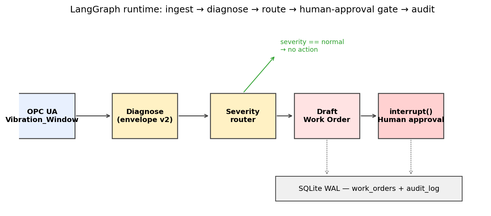
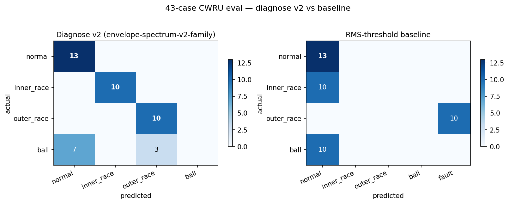
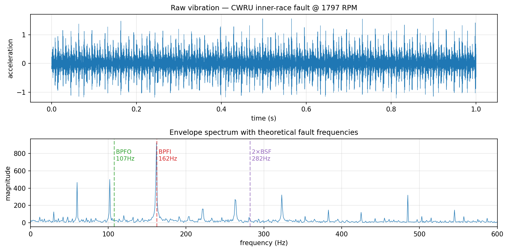
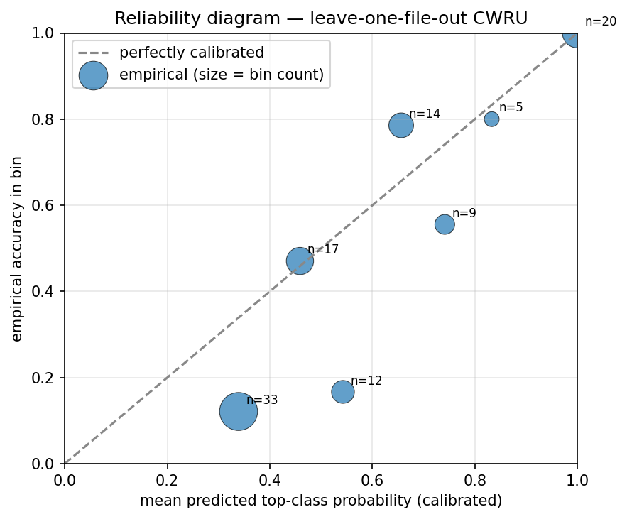

# pdm-agent-mvp

> **Predictive-maintenance agent runtime, not another AI copilot.**
> Vibration-only closed loop on a simulated microgrid BESS asset, ingesting OPC UA, classifying bearing faults with physics-derived diagnostics, drafting work orders, and pausing for human approval — with a SQLite-persisted audit trail.



The repo is the *agent runtime layer*: deterministic diagnostics, LangGraph workflow with `interrupt()`-based human approval, atomic SQLite state transitions, and two thin protocol wrappers (plain HTTP sidecar + an MCP server — see §MCP). Everything you need to evaluate it is here — code, tests, an honest evaluation set, a documented failure mode, and a [companion blog post](docs/blog/runtime-not-copilot.md) on the design.

## At a glance

| | |
|--|--|
| **Stack** | Python 3.11, FastAPI, asyncua (OPC UA), LangGraph + SqliteSaver, SQLite (WAL), scipy, MCP SDK |
| **Foundation** | Inspired by `LGDiMaggio/predictive-maintenance-mcp` (ISO-13374-flavoured diagnostic structure). MVP re-implements the parts we need to keep the dependency graph small and the audit story tight. |
| **Tests** | 76 passing, includes a real-socket OPC UA E2E test, checkpoint-persistence tests, MCP advisory-only security tests, and calibration spec tests |
| **Eval** | 43-case CWRU-derived eval set; **multi-class accuracy 76.7%** (perfect on normal / inner_race / outer_race, 0/10 on ball — see §Evaluation); **binary fault-detection F1 0.87 vs 0.50 baseline** |
| **Sidecar latency** | p50 HTTP overhead 4-14 ms across 0.5/1/2 s windows |
| **Confidence** | Not a calibrated posterior — softmax over deterministic family scores. Misclassifications can still report high confidence; treat as a ranking signal. |

## Quick start

```bash
git clone <this-repo>
cd pdm-agent-mvp
uv venv --python 3.11
source .venv/bin/activate
uv pip install -e ".[dev]"

# Download CWRU bearing subset (4 .mat files, ~13 MB)
python -m pdm_agent.data

# Run full test suite (10 s) — should be 47 passing
python -m pytest

# Build and run the 43-case evaluation, compare against RMS baseline
python -m eval.build_eval_set
python -m eval.run_eval --method diagnose
python -m eval.run_eval --method baseline
```

The sidecar HTTP service runs separately:

```bash
uvicorn pdm_agent.sidecar:app --port 8200
# in another terminal:
python scripts/measure_latency.py --n 30
```

The mock OPC UA server:

```bash
python -m pdm_agent.opcua_mock
```

## Context: companion to EMS-demo

This MVP is the natural next step on top of [EMS-demo](https://github.com/DISSIDIA-986/EMS-demo) — a microgrid energy-management dashboard prototype I built earlier covering BESS / FFR / arbitrage / carbon accounting in React + FastAPI + TimescaleDB. EMS-demo is currently private (ping me for a walkthrough), but this PdM agent stands on its own: nothing in the runtime, eval, or tests below depends on EMS-demo being available.

## Architecture

```
                ┌─────────────────────────────────────┐
                │  EMS-demo (separate repo)           │
                │  Microgrid dashboard, BESS / FFR /  │
                │  arbitrage / carbon  (React + UI)   │
                └────────────────┬────────────────────┘
                                 │ links to pdm-agent
                                 │ sidecar over HTTP
                                 ▼
┌──────────────────────────────────────────────────────────────┐
│                    pdm-agent-mvp                             │
│                                                              │
│  ┌────────────────┐    ┌────────────────────────────────┐    │
│  │ Mock OPC UA    │───▶│ LangGraph workflow             │    │
│  │ (asyncua)      │    │   diagnose → severity route    │    │
│  │ asset model    │    │   ↓                            │    │
│  │ scenario loop  │    │   draft work order             │    │
│  └────────────────┘    │   ↓ (interrupt for alert/      │    │
│                        │       critical)                │    │
│  ┌────────────────┐    │   ↓ human approval gate        │    │
│  │ Diagnostic     │◀──▶│   ↓                            │    │
│  │ sidecar        │    │   persist + audit              │    │
│  │ FastAPI HTTP   │    └────────────────┬───────────────┘    │
│  │ envelope       │                     │                    │
│  │ spectrum v2    │                     ▼                    │
│  │ family score   │    ┌────────────────────────────────┐    │
│  └────────────────┘    │ SQLite (WAL) — work_orders +   │    │
│                        │ audit_log + SqliteSaver        │    │
│                        │ checkpoint                     │    │
│                        └────────────────────────────────┘    │
└──────────────────────────────────────────────────────────────┘
```

### Sidecar rationale

The diagnostic brain (`pdm_agent.sidecar`) is exposed as a small FastAPI service rather than imported directly. Trade-offs:

- ✅ Process-isolated, language-agnostic (any client can POST JSON)
- ✅ Audit-friendly (every diagnose call is an HTTP request loggable separately)
- ✅ Measured: p50 HTTP overhead **4-14 ms** across 0.5/1/2 s windows on local socket. The sidecar is sized for supervisory window-level diagnostics (0.5-2 s), not real-time control.
- Important: the service speaks plain JSON over HTTP, not the MCP protocol directly. Wrapping it as an MCP server is a small follow-up (see Roadmap §5) but explicitly not in this MVP.

### Workflow orchestration: why LangGraph, not Zapier / N8N / Dify

LangGraph fits the "runtime, not copilot" thesis for three reasons:

1. **Code-first state machine** — every transition is reviewable Python; not a config screenshot.
2. **`interrupt()` for human approval** — native primitive, no webhook plumbing; pauses execution until `Command(resume=...)`.
3. **Persistent checkpoints** (`SqliteSaver`) — incidents survive a process restart, exactly what auditors want.

N8N has excellent OPC UA / Modbus nodes — better than what we have here for production deployment. But for a showcase the visual-config story doesn't carry the engineering signal we want. Dify and Zapier are even more LLM/SaaS-oriented and offer less control over the workflow itself. See `docs/orchestration-tradeoffs.md` (TODO) for the full comparison.

## Diagnostic v2: physics-derived bearing fault detection

The diagnostic is deterministic (rule-based) on top of three classical signal-processing steps:

1. **Bandpass to bearing resonance band** (default 2-4 kHz) to isolate fault impulses excited at structural resonance
2. **Hilbert envelope** demodulates the impact train
3. **Family-weighted scoring** at each fault's harmonic frequencies plus FTF sidebands (±1, ±2)

Per-class score is the L1 sum of (peak/background) over harmonics + sidebands, with the first harmonic dominating. The classifier then applies:

- A **separation gate** (top score ≥ 1.3 × runner-up) to suppress cross-class spectral aliasing — important because CWRU's bearing geometry gives 3×BPFO ≈ 2×BPFI, an aliasing path we explicitly limit to harmonic-order 2.
- An **absolute threshold** (family score ≥ 6) below which everything is "normal".

LLM (Claude Haiku) is used **only** to write a natural-language summary on top of the deterministic diagnosis. If `ANTHROPIC_API_KEY` is not set, a deterministic template is used.

## Evaluation

```
Diagnose v2 (envelope-spectrum-v2-family) on 43-case CWRU eval set
═════════════════════════════════════════════════════════════════
Overall accuracy: 33/43 = 76.7%

actual \ pred    normal   inner_race   outer_race   ball
─────────────────────────────────────────────────────────
normal           13       0            0            0
inner_race       0        10           0            0
outer_race       0        0            10           0
ball             7        0            3            0       ← failure mode (see below)

Binary fault detection: precision=1.00  recall=0.77  F1=0.87
```

```
RMS-threshold baseline
═════════════════════════════════════════════════════════════════
Overall accuracy: 23/43 = 53.5%
Binary fault detection: precision=1.00  recall=0.33  F1=0.50
```

**Improvement vs baseline: +74 % relative F1 (0.50 → 0.87)**.



The envelope-spectrum step in action on one real CWRU inner-race window — the diagnostic's primary evidence (red BPFI line at 162 Hz) lines up directly with the largest peak in the envelope spectrum:



### Eval set construction caveats

- The 43 windows are sliced from **4 CWRU .mat files** (one per fault class). There is **no file-level held-out split** — adjacent windows come from the same physical bearing run, so the multi-class accuracy above is optimistic vs cross-bearing generalisation. Roadmap §2 lists this as the next eval upgrade.
- Headline metric in §At-a-glance is the **binary fault-vs-normal F1** because the multi-class breakdown is dominated by the ball-fault failure mode. Both numbers are reported here so neither story can be cherry-picked.

### Confidence calibration (research / WIP)

The deterministic family-score diagnostic outputs an uncalibrated softmax `confidence` field that can read 0.99 on misclassifications. To address this we ship a multinomial temperature-scaling calibrator (`pdm_agent.calibration`, 2 fit parameters: `T` + `b_normal`). Pass a fitted `Calibrator` into `diagnose()` to receive `calibrated_probabilities` alongside the deterministic verdict — the calibrator does NOT change the deployed `predicted_class` decision.

Reported on a **leave-one-FILE-out** cross-validation over 110 windows from 10 CWRU files (3 defect diameters × 3 fault classes + normal):

```
calibrated posterior top-1 accuracy = 0.491   (argmax of calibrated P(class | scores))
uncalibrated diagnose() accuracy    = 0.636   (control — the deployed rule-based decision)
pooled top-label ECE                = 0.141
fold ECE mean ± std                 = 0.317 ± 0.221    (range 0.000 — 0.624)
multiclass Brier                    = 0.690
```



Two things the numbers honestly say:

1. **Calibrated and rule-based are not apples-to-apples.** The 0.491 is the argmax of the calibrated 4-class posterior; the 0.636 is the diagnostic's deployed `predicted_class`. The calibrator is a research artifact riding alongside the decision path, not a replacement for it.
2. **Per-fold ECE varies from 0.000 to 0.624.** Pooling everything into one number (0.141) hides real cross-file shift — different defect diameters present family-score distributions the calibrator didn't see in training. This is the honest cost of an 110-window training pool.

Position: this is a working research artifact, not "calibration solved". The methodology (multinomial T-scaling, LOO-by-file, fold-level ECE + standard multiclass Brier) is the right shape for scaling up to a larger CWRU pool or a real customer dataset. Implementation is in `src/pdm_agent/calibration.py`; run via `python -m eval.run_calibration` to regenerate.

### Failure mode: ball-defect detection (0/30 across three defect sizes)

CWRU ball signatures concentrate energy in FTF-modulated sidebands with a weak harmonic fundamental; on top of that, ball impacts are slip-sensitive and not strictly periodic. Classical envelope-spectrum methods systematically under-detect them on this rig.

We tried lifting this in **Roadmap §3** by extending the envelope family: order tracking, envelope cepstrum, more harmonics + sidebands, squared envelope spectrum, and spectral-kurtosis-driven band selection. The full experiment is at [`scripts/ball_detection_experiment.py`](scripts/ball_detection_experiment.py); the negative-result write-up is at [`docs/research/ball-detection.md`](docs/research/ball-detection.md). Summary:

```
method                              0.007"   0.014"   0.021"   total
A. baseline (diagnose v2)            0/10     0/10     0/10    0/30
B. more harmonics + sidebands        0/10     0/10     0/10    0/30
C. SES at fixed 2-4.5 kHz band       0/10     0/10     0/10    0/30
D. SK-selected band + SES            1/10     0/10     0/10    1/30
```

The operators (`pdm_agent.order_tracking`) are implemented correctly and tested at 7/7; they're preserved as a research artifact and as the right shape to plug into the next-stage methods (AR-residual + SES, cyclic spectral coherence, supervised classification). The negative-result write-up cites the literature (Smith & Randall 2015, Polito 2021, IEEE Access 2023) that documents this exact phenomenon on CWRU.

Why ship the negative result instead of tuning until something ticks up: it's the more useful portfolio signal. Real industrial bearing diagnostics deal with methods that work in some operating regimes and not others; saying so out loud is part of the engineering.

### Scope statement (read this before reusing)

This evaluation is on the [CWRU Bearing Data Center](https://engineering.case.edu/bearingdatacenter/) drive-end bearing dataset. It is an **analog benchmark** for BESS auxiliary equipment (cooling-pump / fan) bearing health. It **does NOT validate BESS PdM in production**. Frequencies, mounting, load profile, and noise characteristics of a real BESS auxiliary bearing differ; transfer would require field data and re-tuning. The reusable parts of this MVP are the *patterns* — LangGraph state machine with `interrupt()` gates, atomic SQLite work-order transitions, family-score diagnostic, audit-log trail. The data sources are deliberately public benchmarks so the repo can stay open.

## License & Compliance

Project code: **MIT** (see `LICENSE`).

Third-party components and their effective constraints on portfolio use:

| Component | License | Implications |
|---|---|---|
| CWRU Bearing Data | Academic open use | Free to download and report results in this repo |
| LGDiMaggio/predictive-maintenance-mcp (inspiration) | MIT | We borrow ideas; this repo does not vendor its code |
| LangGraph + SqliteSaver | MIT | OK |
| asyncua | LGPL | OK for application use; no static linking |
| scipy / numpy | BSD-3 / BSD-3 | OK |
| FastAPI / uvicorn | MIT / BSD-3 | OK |

**Datasets that we intentionally do NOT use in MVP** despite being mentioned in scoping discussions, because of license-vs-portfolio mismatch flagged in audit round 3:

| Dataset | License | Why excluded |
|---|---|---|
| ELPV (PV electroluminescence) | CC BY-NC-SA 4.0 | Non-commercial — would complicate any later commercial fork |
| MVTec AD | CC BY-NC-SA 4.0 | Same |
| YOLO26 weights | AGPL-3.0 | Would force the entire repo to AGPL on redistribution |

If extending this MVP toward PV-vision or acoustic modalities, evaluate license fit deliberately. ELPV / MVTec AD are fine for *learning* and *non-commercial portfolios*; AGPL-licensed model weights are a sharper trap.

## MCP

There is an MCP server wrapper around the same `diagnose()` brain — see [`src/pdm_agent/mcp_server.py`](src/pdm_agent/mcp_server.py). Local-development only (no auth, binds to 127.0.0.1). Tools and resources:

| Surface | Name | Effect |
|---|---|---|
| tool | `diagnose_vibration` | run envelope-spectrum-v2 on a signal array |
| tool | `diagnose_synthetic` | generate + diagnose a textbook synthetic window |
| tool | `poll_opc_asset` | read latest vibration window from the mock OPC UA server, immediately diagnose |
| tool | `list_work_orders` | read-only list filtered by status |
| tool | `propose_decision_for_work_order` | **advisory only** — records an `approve` / `reject` recommendation in a separate `agent_recommendations` table; does NOT mutate work-order status |
| tool | `list_agent_recommendations` | read agent-proposed recommendations |
| tool | `list_audit_trail` | read the work_orders audit log |
| resource | `pdm://config` | diagnostic configuration + scope statement |
| resource | `pdm://security` | explicit security-boundary statement (no auth, advisory-only write surface) |
| resource | `pdm://error-analysis` | live `eval/error_analysis.md` |

**Why no `approve_work_order` tool:** an LLM client could otherwise pass `decided_by="human:alice"` and silently approve maintenance work no human ever saw. The advisory-only model is enforced in code — `proposed_by` is regex-checked against `^agent:[a-zA-Z0-9._-]{1,64}$`, so human impersonation is rejected at the tool boundary. Final work-order status transitions are reachable only through a trusted-process caller of `WorkOrderStore.decide()`. This MVP does not ship an authenticated operator UI; that's the production gap, documented in `pdm://security`.

Run via stdio for Claude Code / Claude Desktop:

```bash
python -m pdm_agent.mcp_server
```

Or via SSE for MCP Inspector (still local-only):

```bash
python -m pdm_agent.mcp_server --transport sse --port 8210
```

## Repository layout

```
src/pdm_agent/
  data.py              CWRU loader + deterministic synthetic vibration generator
  diagnostic.py        envelope-spectrum v2 with family scoring + RPM-derived tolerance
  calibration.py       multinomial temperature-scaling posterior calibrator (research)
  sidecar.py           FastAPI service exposing diagnose() over HTTP
  mcp_server.py        MCP wrapper (advisory-only decision surface; see §MCP)
  opcua_mock.py        asyncua mock server publishing a scenario loop
  opcua_client.py      browse-by-name OPC UA client
  workflow.py          LangGraph state machine with persistent SqliteSaver checkpoints
  workorder.py         SQLite WAL store + atomic state transitions + audit_log
tests/
  test_data.py                     synthetic generator + validation
  test_diagnostic.py               peak-detection physics sanity
  test_sidecar.py                  HTTP integration
  test_mcp_server.py               MCP tools + advisory-only security model
  test_workorder.py                lifecycle + audit + concurrency-safe transitions
  test_workflow.py                 LangGraph routing + interrupts
  test_workflow_persistence.py     SqliteSaver across rebuilds + thread-id guards
  test_e2e.py                      real-socket OPC UA → workflow → audit trail
  test_smoke.py                    cross-module fast checks
eval/
  build_eval_set.py    deterministic 43-case eval generator
  run_eval.py          metrics + confusion + error analysis
  eval_v1.jsonl        the eval set itself (checked in for reproducibility)
  metrics_diagnose.json / metrics_baseline.json
  confusion_diagnose.txt / confusion_baseline.txt
  error_analysis.md
scripts/
  sanity_check_cwru.py
  measure_latency.py
data/raw/              CWRU .mat files (downloaded on first run; .gitignored)
```

## Adversarial-review provenance

This project was scoped through three rounds of independent adversarial review (4-5 agents per round + Codex) — `../ai-cad-electrical-research/AUDIT-ROUND3.md` documents the final accepted scope. Notable audit-driven changes that landed here:

- 🔴 **Scope cut from 4-week-3-modality to 2-week-vibration-only** (R2 + R4 + Codex R3 agreed the original was over-promised)
- 🔴 **Algorithm rewrite from single-harmonic to family + sideband scoring** (Codex P3 review caught that 0/10 ball detection was algorithmic, not threshold)
- 🔴 **SqliteSaver persistent checkpoint + thread-id reuse guard** (Codex P3 caught that MemorySaver loses incidents on restart)
- 🔴 **SQLite WAL + atomic `UPDATE ... WHERE status=?`** (TOCTOU race fixed before P4)
- 🟡 **OPC UA browse-by-name lookup** (Codex P3 flagged fragile "first child" indexing)
- 🟡 **Honest data-license & dataset-mismatch disclosure** (Codex R3 caught the YOLO26 AGPL / ELPV CC-BY-NC-SA inconsistency)

## For production use beyond this MVP

This codebase is **not** a drop-in BESS agent. To deploy:

1. **Replace mock OPC UA with a real gateway** — TLS, Basic256Sha256 security policy, X.509 user identity. `opcua_mock.py` uses `NoSecurity` for local dev only.
2. **Re-tune family-score thresholds on your bearing data** — current thresholds are CWRU-derived (12 kHz, ~1800 RPM, SKF 6205-2RS geometry). Different geometry → different fault frequencies → different separation gates.
3. **Calibrate `confidence`** — current value is a softmax over deterministic family scores, not a posterior. Use Platt scaling or isotonic regression on a held-out labelled set before showing the number to operators.
4. **Add approval-timeout + escalation** — `work_orders.status = 'pending_approval'` has no TTL. Production needs a sweeper that escalates / auto-rejects after N hours, plus on-call notification.
5. **Production observability** — Prometheus / OpenTelemetry for sidecar p99 latency, work-order queue depth, decision-mix drift over time.
6. **Real CMMS integration** — current work-order write-back is a SQLite row, not a Maximo/Fiix/Snipe-IT ticket. The schema is shaped to map cleanly onto these but the HTTP adapter is not written.
7. **Bearing-specific algorithm extension** — order tracking + cepstrum for ball-fault detection (currently 0/10); supervised classifier on customer-labelled data for fault-severity calibration.

The design patterns (audit log, atomic state transitions, persistent checkpoints, honest eval with declared failure modes, license-conscious dataset choice) are reusable. The thresholds and OT integration are not.

## Status

**MVP (vibration-only).** Roadmap, in priority order if extended:

1. **Acoustic line** (MIMII fan subset → multimodal severity fusion)
2. **File-level held-out CWRU split** for cross-bearing generalisation (current eval is same-file-window)
3. **Order tracking + cepstrum** to lift ball-fault detection above zero
4. **Confidence calibration** via Platt / isotonic on a labelled held-out set
5. ~~MCP server wrapper around the existing HTTP sidecar~~ — done in commit 665e391; see §MCP above
6. **PV-vision line** (using a non-NC dataset, e.g. self-curated; ELPV is for learning only)
7. ~~Confidence calibration via Platt / temperature scaling~~ — shipped as a research artifact; see §Confidence calibration above

## Author's note

The interesting work in this repo is the runtime layer — the LangGraph state machine, the atomic SQLite transitions, the family-score diagnostic, the audit trail — not the synthetic data underneath. The patterns are what would carry over to a real industrial deployment; the public benchmarks are what made publishing it possible. If you are reading this from a hiring context, the section worth re-reading is "For production use beyond this MVP" — it lists exactly what would change between this code and something I would actually ship to a customer.

— Yupo
